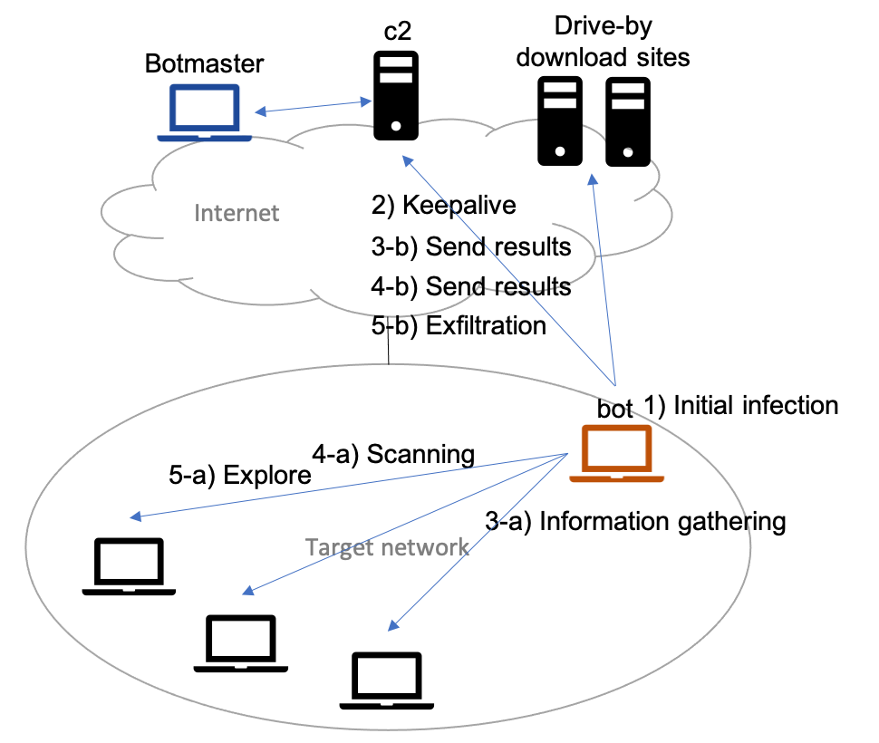

# BotSim

BotSim simulates bot activities in an enterprise network and produces
netflow like information of each activity with considerations of
weekday, work time and time difference.

## Usage
~~~
$ python3 botsim.py -h
usage: botsim.py [-h] [-s {6,7,8,9}] [-e {15,16,17,18}] [-i INIT_TIME]
                 [-a {0,1}] [-t INIT_TARGET_HOST] [-n INIT_TARGET_NW]
                 [-l {0,1,2,3}] [-c C2_HOST] [-k C2_INTERVAL]
                 [-d BOTMASTER_TD] [-o MAX_OVERWORK] [-m LIMIT_DAYS] [-v]

Generate netflow log for botnet activities.

optional arguments:
  -h, --help           show this help message and exit
  -s {6,7,8,9}         time to start working [6...10] (default: 8)
  -e {15,16,17,18}     time to go home [14...22] > work_start (default: 17)
  -i INIT_TIME         date time of initial infection [%Y/%m/%dT%H:%M:%S.%f]
                       (default: 7 days ago)
  -a {0,1}             attack trigger of initial infection [0: phishing, 1:
                       e-mail attachement] (default: 0)
  -t INIT_TARGET_HOST  target host of initial infection [IPv4 Address]
                       (default: 192.168.0.104)
  -n INIT_TARGET_NW    target network of initial infection [IPv4 Network]
                       (default: 192.168.0.0/24)
  -l {0,1,2,3}         attack level [0: infection, 1: host information
                       gathering, 2: scanning, 3: exfitration] (default: 3)
  -c C2_HOST           c2 [IPv4 Address:Port] (default: 67.202.92.14:80)
  -k C2_INTERVAL       interval for keepalive with c2 [Seconds] (default:
                       3600)
  -d BOTMASTER_TD      time difference to botmaster location [Hours] (default:
                       0)
  -o MAX_OVERWORK      maximum overtime work for botmaster [Hours] (default:
                       6)
  -m LIMIT_DAYS        maximum number of days to keep attacking [Days]
                       (default: randint(30, 90))
  -v, --version        show program's version number and exit
~~~

## Detail

### 1) Initial Infection
Initial infection has two attack vectors. One is email phishing, which directs users to a malicious site and infects them with a bot. Commonly referred to as drive-by download attack, it occurs multiple redirections by small-sized redirect codes or iframes embedded in the compromised web sites. Then a vulnerability in the browser or its plug-ins is exploited to install and execute a bot. The other is to let the user open an email attachment. The attachment itself, or the exploit code embedded in the attachment, can be made to install and run a bot.

The type, flags, bytes, packets, and duration in the flow log being generated during drive-by download are determined by the statistics of legitimate HTTP traffic. The IP address of the web site is determined randomly. The port number of the server is 80 or 443, and the port number of the client is randomly determined from the dynamic port range.

The attack level given by the argument determines how deep the attack will proceed in subsequent stages. The botmaster can send commands to the bot via c2 only during the time when both the botmaster with the time difference and the target network are in active. Depending on the conditions, the attack may proceed for several days, but it will be forced to end when the number of days given in the argument is reached. The thinking time until the next action in the following steps and within the step after seeing the result of each activity is statistically determined based on the observed cases[1] of targeted attacks.

### 2) Keepalive
Once a bot is infected, it communicates periodically with the c2 server in order to be able to receive commands from the botmaster via c2. The type, flags, bytes, packets, and duration in the flow log are randomly determined. The IP address and port number of c2 and the keepalive interval are given by the arguments of the BotSim while the port number of the client is randomly chosen from the dynamic port range. Between the start and end of business hours in the target's network given by the arguments, the keepalive continues.

### 3) Information Gathering
To get an overview of the infected host and its network, the bot runs typical commands such as "tasklist", "systeminfo", "netstat", "ipconfig", "dir", "net view/user/group", etc., and sends the results to c2.

### 4) Scanning
The bot checks the reachability to the hosts by "ping" and sends the results of the port scan for reachable hosts to c2. Although pings and scans within the target network do not appear in the flow logs acquired by the gateway router to the Internet, these flow logs can be output by excluding BotSim's comment out.

### 5) Explore
For the hosts scanned in the previous step, the bot explores interesting files from shared folders, etc. After exploring at a random timing the bot exfiltrates a certain file to C2. Although exploring files within the target network do not appear in the flow logs acquired by the gateway router to the Internet, these flow logs can be output by excluding BotSim's comment out.

## Limitation
* The size of the transferred data and the duration of the transfer are randomly chosen from a certain range.
* The lateral movement and privilege escalation is not considered.
* Spreading the bot infection to multiple hosts is not considered.

## Reference
* [1] Masato Terada, Takayuki Sato, Sho Aoki, Tomohiro Shigemoto, Ryohei Yoshino, Satoshi Kamekawa, Tsutomu Shimizu, and Kenta Hagihar, ``Research Data Set "Behavior Observable System 2014－2017" for Cyber Security Countermeasure,'' IPSJ Journal, vol.60, no.12, pp.2211-2222, December 2019. (in Japanese)
